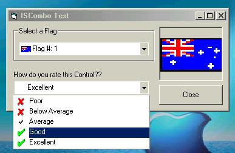



## \_\_ A Better Image Combo: ISCombo \_\_

### Description

This is a Flat ImageCombo, I made It, because I was bored with the "normal" Combo from VB. And I could'n detect when user selectted an Item on the list. So I decided make one better. It's very userful ( I hope ) please Check It out and vote. Comments are also very apreciated.
 
### More Info
 

             |
---                |---
**Submitted On**   |2002-05-04 12:39:56
**By**             |[Fred\.cpp](https://github.com/Planet-Source-Code/PSCIndex/blob/master/ByAuthor/fred-cpp.md)
**Level**          |Intermediate
**User Rating**    |4.5 (286 globes from 64 users)
**Compatibility**  |VB 5\.0, VB 6\.0
**Category**       |[Custom Controls/ Forms/  Menus](https://github.com/Planet-Source-Code/PSCIndex/blob/master/ByCategory/custom-controls-forms-menus__1-4.md)
**World**          |[Visual Basic](https://github.com/Planet-Source-Code/PSCIndex/blob/master/ByWorld/visual-basic.md)
**Archive File**   |[\_\_\_A\_Bette7928954200\.zip](https://github.com/Planet-Source-Code/fred-cpp-a-better-image-combo-iscombo__1-34300/archive/master.zip)

